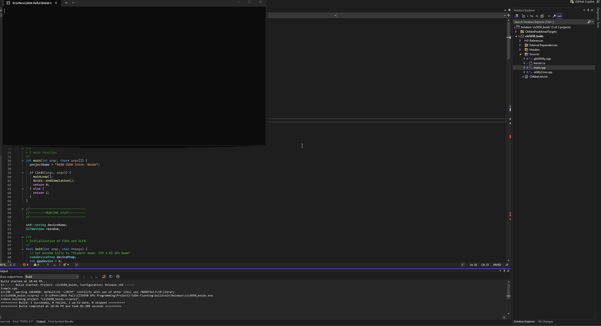
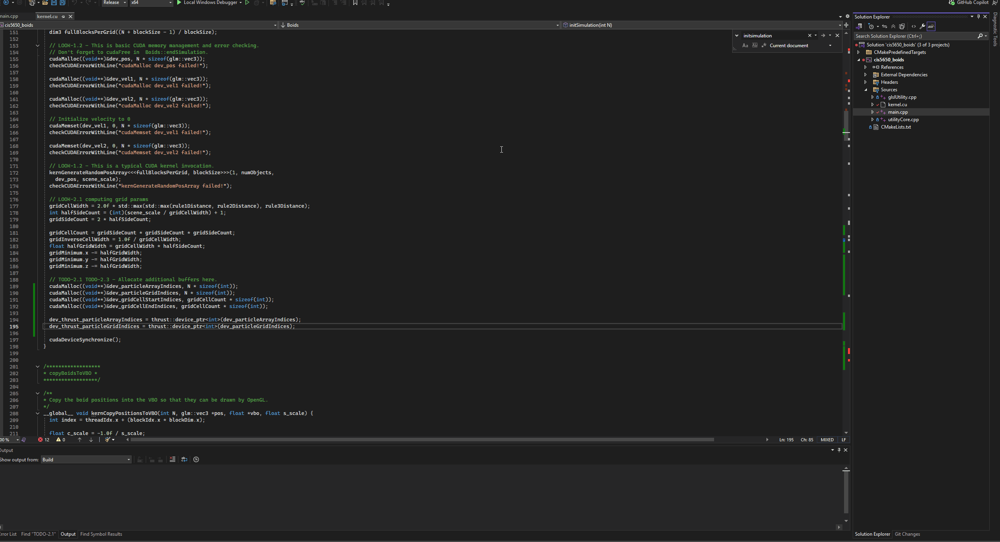

**University of Pennsylvania, CIS 5650: GPU Programming and Architecture,
Project 1 - Flocking**

* Shanshan Wu
* Tested on: Windows 11, AMD Ryzen 9 270 @ ~4.0GHz, 32GB RAM, NVIDIA GeForce RTX 5070 Laptop GPU (personal laptop)

## Demo

<table>
<tr>
<td align="center"> Naive (Brute Force)</td>
<td align="center"> Uniform Grid</td>
<td align="center"> Coherent Uniform Grid</td>
</tr>
</table>

## Part 2: Uniform Grid

### 2.1 — Why reset the grid buffers first? (LOOK-2.1)

**Q:** Before `kernIdentifyCellStartEnd` runs, `dev_gridCellStartIndices` and `dev_gridCellEndIndices` are first reset to -1 with `kernResetIntBuffer`. Consider how this could be useful for indicating that a cell does not enclose any boids.

**A:** Without this reset step, a cell that happens to have no boids in it this frame is never written to by `kernIdentifyCellStartEnd` (which only touches cells that actually appear in the sorted `dev_particleGridIndices` array), so its start/end indices would silently keep whatever stale values were left over from a previous frame. Resetting both buffers to -1 first guarantees that any cell nobody wrote to this frame is unambiguously marked as empty, so the neighbor search kernel can safely detect and skip it (`if (start == -1) continue;`) instead of reading garbage or, worse, an outdated range from a different frame's grid layout.

### 2.2 — Pushing the limits

The uniform grid is dramatically faster than the naive brute-force search in the typical case — as boid count grows, naive's all-pairs check becomes the bottleneck almost immediately, while the uniform grid keeps each boid's search limited to its local neighborhood. Pushing the boid count up to 20,000 (uniform grid, visualization on) still runs, but framerate drops sharply to around 170 FPS:

## Performance Analysis

All measurements below were taken in Release mode with V-Sync disabled, reading steady-state FPS from the window title. 
### How does the number of boids affect performance?

.png>)

| Boid Count | Naive FPS | Uniform Grid FPS | Coherent Grid FPS |
|---|---|---|---|
| 1,000 | 1080 | 1240 | 1100 |
| 5,000 | 430 | 1150 | 1230 |
| 10,000 | 212 | 1030 | 1130 |
| 25,000 | 63 | 980 | 1100 |
| 50,000 | 20 | 580 | 880 |
| 100,000 | 4.5 | 360 | 900 |
| 250,000 | 1 | 140 | 450 |
| 500,000 | 0 | 45 | 240 |

.png>)

| Boid Count | Naive FPS | Uniform Grid FPS | Coherent Grid FPS |
|---|---|---|---|
| 1,000 | 1600 | 1890 | 1800 |
| 5,000 | 550 | 1750 | 1850 |
| 10,000 | 240 | 1640 | 1750 |
| 25,000 | 72 | 1500 | 1800 |
| 50,000 | 22 | 780 | 1600 |
| 100,000 | 6 | 460 | 1340 |
| 250,000 | 1 | 170 | 700 |
| 500,000 | 0 | 47 | 320 |

Naive brute-force checks every other boid, so its cost grows quadratically with N. FPS drops sharply as boid count increases and is already down to 22 by N=50,000, effectively unusable soon after. Both grid-based methods scale far more gently, since spatial partitioning limits each boid to checking only nearby cells regardless of total population.

One thing that stood out with visualization off: at N=1,000, Coherent Grid FPS is sometimes even lower than Uniform Grid's. My guess is that at such a small boid count, the extra work coherent grid does every frame — rearranging `pos`/`vel1` into sorted order via `kernShuffleCoherentData` isn't a good trade-off yet, since there just aren't enough boids for the payoff (better-coalesced memory access) to outweigh that added shuffle step.

Although framerate fluctuates over time for every implementation, the degree of that fluctuation isn't the same across methods. It's most significant for Coherent Grid, moderate for Uniform Grid, and smallest for Naive. 

### How does block size affect performance?

| Block Size | Naive FPS | Uniform Grid FPS | Coherent Grid FPS |
|---|---|---|---|
| 64 | 550 | 1770 | 1860 |
| 128 | 550 | 1750 | 1850 |
| 256 | 565 | 1800 | 1880 |
| 512 | 540 | 1820 | 1900 |
| 1024 | 370 | 1800 | 1740 |

Increasing or decreasing block size doesn't change FPS very much for most of the range tested (64–512). Block size only changes how threads are grouped into blocks, not the total amount of parallel work (fixed by N), so as long as enough warps are resident per SM to hide memory latency, performance barely moves. At block size 1024, though, the performance of Naive and Coherent drops noticeably (Naive 540 → 370, Coherent 1900 → 1740), while Uniform Grid stays essentially flat (1820 → 1800). The likely explanation is that at 1024 threads per block, Naive and Coherent's per-thread register usage limits how many blocks can stay resident on an SM at once, lowering occupancy.

### Did the coherent uniform grid improve on the uniform grid? Was this expected?

Using the boid-count data above: yes, Coherent Grid is faster than Uniform Grid at essentially every boid count tested, and the improvement gets more and more significant as boid count increases — at N=10,000 the two are nearly tied (1750 vs 1640 FPS, ~7% faster), but by N=500,000 Coherent is nearly 7x faster (320 vs 47 FPS). I think the reason is that removing the `particleArrayIndices[i]` indirection means threads in the same warp read contiguous, coalesced memory addresses instead of scattered ones, and that benefit only shows up at large N.

### Did changing cell width (8 vs 27 neighboring cells) affect performance?

| Boid Count | 8-Cell FPS (2x width) | 27-Cell FPS (1x width) | Difference (%) |
|---|---|---|---|
| 1,000 | 1800 | 1860 | -3.2% |
| 5,000 | 1850 | 1770 | 4.5% |
| 10,000 | 1750 | 1770 | -1.1% |
| 25,000 | 1800 | 1870 | -3.7% |
| 50,000 | 1600 | 1050 | 52.4% |
| 100,000 | 1340 | 1500 | -10.7% |
| 250,000 | 700 | 900 | -22.2% |
| 500,000 | 307 | 520 | -41.0% |

27-cell (cellWidth = 1x the search threshold) is mostly faster than 8-cell (cellWidth = 2x), except for one case at N=50,000 where 8-cell comes out about 52% faster. The general trend makes sense once you separate cell *count* from cell *volume*: the 27-cell configuration's cells are 1/8 the volume of the 8-cell configuration's, so even though 3.4x more cells get visited, each one holds far fewer boids. 
